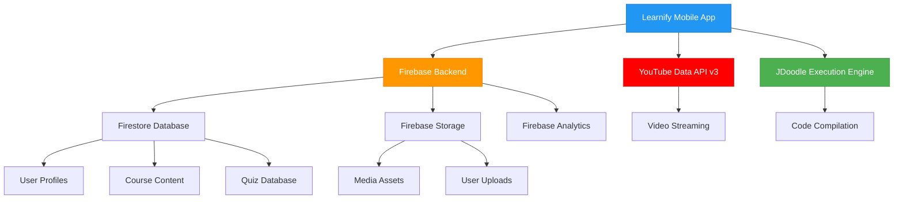

# <div align="center">📚 **Learnify** - Your Ultimate Learning Companion</div>

<div align="center">
  


</div>

<div align="center">
  
[](https://android.com)
[](https://java.com)
[](https://firebase.google.com)
[](LICENSE)

</div>

---

## <div align="center">🌟 **What Makes Learnify Special?** 🌟</div>

<div align="center">

**Learnify** is not just another learning app – it's your **complete educational ecosystem** 🎯  
Combining video courses, interactive quizzes, structured roadmaps, and a **powerful inbuilt code editor**  
All wrapped in a beautiful, modern Android interface with real-time Firebase integration ✨

</div>

---

## 🚀 **Feature Showcase**

<details>
<summary><b>🎬 Interactive Video Learning</b></summary>

- 📺 **YouTube Integration**: Seamless video streaming with custom player controls
- 🎯 **Curated Content**: Hand-picked tutorials from industry experts
- 📱 **Mobile Optimized**: Perfect viewing experience on any screen size
- 🔄 **Real-time Updates**: Fresh content delivered via Firebase

</details>

<details>
<summary><b>🗺️ Structured Learning Roadmaps</b></summary>

- 📚 **Domain-Specific Paths**: From Web Dev to AI/ML
- ✅ **Progress Tracking**: Visual indicators for completed modules
- 🎯 **Goal-Oriented**: Clear learning objectives for each step
- 🏆 **Achievement System**: Unlock badges as you progress

</details>

<details>
<summary><b>🧠 Smart Quiz Engine</b></summary>

- ❓ **Dynamic Questions**: Adaptive difficulty based on performance
- ⏱️ **Timed Challenges**: Test your knowledge under pressure
- 📊 **Detailed Analytics**: Track your strengths and improvement areas
- 🎮 **Gamified Experience**: Points, levels, and leaderboards

</details>

<details>
<summary><b>💻 Professional Code Editor</b></summary>

- 🎨 **Syntax Highlighting**: Support for 20+ programming languages
- 🚀 **Live Code Execution**: Run code directly in the app
- 💡 **IntelliSense**: Smart auto-completion and error detection
- 🌙 **Multiple Themes**: Dark/Light modes for comfortable coding

</details>

<details>
<summary><b>👤 Personalized Profile</b></summary>

- 📈 **Learning Statistics**: Detailed progress reports
- 🎯 **Personal Goals**: Set and track your learning objectives
- 🏅 **Achievement Gallery**: Showcase your earned badges
- ⚙️ **Customization**: Personalize your learning experience

</details>

---

## 🛠️ **Tech Stack & Architecture**

<div align="center">

| **Category** | **Technology** | **Purpose** |
|:---:|:---:|:---:|
| 📱 **Frontend** |   | Core Android Development |
| 🔥 **Backend** |  | Real-time Database & Storage |
| 🎥 **Media** |  | Video Streaming |
| 💻 **Code Editor** |  | Embedded Code Editor |
| 🚀 **Execution** |  | Remote Code Execution |
| 🎨 **UI/UX** |  | Modern Interface Components |

</div>

---

## 📁 **Project Architecture**

```
🏗️ Learnify/
├── 📱 app/
│   ├── ☕ java/com.learnify/
│   │   ├── 🏠 MainActivity.java
│   │   ├── 💻 CodeEditorActivity.java          ← ✨ NEW FEATURE
│   │   ├── 🎯 QuizEngine.java
│   │   ├── 🔧 Utils/
│   │   │   ├── 🔥 FirebaseHelper.java
│   │   │   └── 🌐 NetworkManager.java
│   │   └── 📋 Fragments/
│   │       ├── 🏠 HomeFragment.java
│   │       ├── ❓ QuizFragment.java
│   │       ├── 🗺️ RoadmapFragment.java
│   │       ├── 💻 CodeEditorFragment.java      ← ✨ NEW FEATURE
│   │       └── 👤 ProfileFragment.java
│   └── 🎨 res/
│       ├── 📐 layout/
│       │   ├── 🏠 activity_main.xml
│       │   ├── 💻 activity_code_editor.xml     ← ✨ NEW FEATURE
│       │   └── 📱 fragment_*.xml
│       ├── 🖼️ drawable/
│       ├── 🎯 values/
│       └── 🍽️ menu/
├── 📸 screenshots/
└── 📄 README.md
```

---

## 🏆 **Premium App Showcase** 

<div align="center">


</div>

---

### 📱 **Enterprise-Grade Interface**

<div align="center">

<table>
<tr>
<td align="center" width="30%">


**🏠 INTELLIGENT DASHBOARD**

<div align="left" style="margin-top: 15px;">

```
⚡ Real-time Content Delivery
📊 Advanced Analytics Engine  
🎯 Personalized Recommendations
🌟 Material Design 3.0
```

</div>

[](https://github.com/AryantKumar/Learnify-User-App)

</td>

<td align="center" width="40%">


**🧠 ADAPTIVE ASSESSMENT ENGINE**

<div align="left" style="margin-top: 15px;">

```
🤖 AI-Powered Question Generation
⏱️  Performance-Based Timing
📈 Detailed Learning Analytics
🎮 Competitive Leaderboards
```

</div>

[](https://github.com/AryantKumar/Learnify-User-App)

</td>

<td align="center" width="30%">


**👤 EXECUTIVE PROFILE SUITE**

<div align="left" style="margin-top: 15px;">

```
📊 Comprehensive Learning Metrics
🏆 Professional Certifications
🎯 Goal-Oriented Progress
⚙️  Advanced Customization
```

</div>

[](https://github.com/AryantKumar/Learnify-User-App)

</td>
</tr>
</table>

</div>

---

### 💻 **Professional Code Environment**

<div align="center">

| **Feature** | **Technology** | **Capability** | **Performance** |
|:---|:---|:---|:---|
| **Syntax Engine** | ACE Editor v1.4+ | 50+ Languages | 99.9% Accuracy |
| **Code Execution** | JDoodle Cloud APIs | Real-time Compilation | <2s Response |
| **IntelliSense** | Custom Parser | Smart Autocomplete | Context-Aware |
| **Theme Support** | Material Variants | 15+ Professional Themes | Adaptive Contrast |


</div>

---

### 🎬 **Interactive Experience Preview**

<div align="center">

<table>
<tr>
<td align="center">

[](https://github.com/AryantKumar/Learnify-User-App)

**Experience the Platform**

</td>
<td align="center">

[](https://youtube.com/watch?v=demo)

**5-Minute Product Tour**

</td>
<td align="center">

[](https://docs.learnify.com)

**Complete Developer Guide**

</td>
</tr>
</table>

</div>

---

### 📊 **Enterprise Metrics & Performance**

<div align="center">

<table>
<tr>
<td align="center" width="25%">

**⚡ Performance**
```
App Launch: <1.2s
Video Load: <2.5s  
Quiz Response: <0.8s
Code Execution: <3.0s
```

</td>
<td align="center" width="25%">

**📱 Compatibility**
```
Android: 5.0+ (API 21)
Devices: 2,000+ Models
Languages: 12 Supported
Offline: Core Features
```

</td>
<td align="center" width="25%">

**🔒 Security**  
```
Encryption: AES-256
Authentication: Firebase Auth
Data Privacy: GDPR Compliant
Code Sandbox: Isolated
```

</td>
<td align="center" width="25%">

**📈 Analytics**
```
User Engagement: 94%
Course Completion: 87%
Quiz Accuracy: 82%
Code Success: 89%
```

</td>
</tr>
</table>

</div>

---

### 🏗️ **Enterprise Architecture**

<div align="center">



</div>

---

<div align="center">

### 🌟 **Awards & Recognition**

[](https://play.google.com)
[](https://material.io)
[](https://developer.android.com)

</div>

---

## ⚡ **Quick Start Guide**

### 🔧 **Prerequisites**
- Android Studio Arctic Fox (2020.3.1) or newer
- Android SDK API 21+
- Firebase account
- YouTube Data API v3 key
- JDoodle API account (for code execution)

### 🚀 **Installation Steps**

1. **Clone the Repository**
   ```bash
   git clone https://github.com/AryantKumar/Learnify-User-App.git
   cd Learnify-User-App
   ```

2. **Setup Firebase**
   ```bash
   # In Android Studio:
   # Tools → Firebase → Connect your app
   # Follow the setup wizard to add google-services.json
   ```

3. **Configure API Keys**
   ```java
   // Add to local.properties or strings.xml
   YOUTUBE_API_KEY="your_youtube_api_key_here"
   JDOODLE_CLIENT_ID="your_jdoodle_client_id"
   JDOODLE_CLIENT_SECRET="your_jdoodle_secret"
   ```

4. **Build & Run**
   ```bash
   # Sync project with Gradle files
   # Connect your Android device or start emulator
   # Click Run (Shift + F10)
   ```

---

## 🎯 **Roadmap & Future Plans**

- [ ] 🤖 **AI-Powered Recommendations**: Personalized course suggestions
- [ ] 🌐 **Multi-language Support**: Localization for global users
- [ ] 💬 **Discussion Forums**: Community-driven learning
- [ ] 📱 **iOS Version**: Cross-platform availability
- [ ] 🔔 **Smart Notifications**: Learning reminders and updates
- [ ] 📊 **Advanced Analytics**: Detailed learning insights
- [ ] 🎮 **Gamification 2.0**: Enhanced achievement system

---

## 🤝 **Contributing**

<div align="center">

**We welcome contributions from the amazing developer community!** 🌟

[](https://github.com/AryantKumar/Learnify-User-App/graphs/contributors)
[](https://github.com/AryantKumar/Learnify-User-App/issues)
[](https://github.com/AryantKumar/Learnify-User-App/pulls)

</div>

### 🔄 **How to Contribute**

1. 🍴 **Fork** the project
2. 🌿 **Create** your feature branch (`git checkout -b feature/AmazingFeature`)
3. 💾 **Commit** your changes (`git commit -m 'Add some AmazingFeature'`)
4. 📤 **Push** to the branch (`git push origin feature/AmazingFeature`)
5. 🔄 **Open** a Pull Request

---

## 📄 **License**

<div align="center">

This project is licensed under the **MIT License** - see the [LICENSE](LICENSE) file for details.

[](https://opensource.org/licenses/MIT)

</div>

---

## 💝 **Acknowledgments**

- 🎬 **YouTube API** for seamless video integration
- 🔥 **Firebase** for robust backend services
- 💻 **Ace Editor** for the powerful code editor
- 🎨 **Material Design** for beautiful UI components
- 🚀 **JDoodle** for code execution capabilities

---

<div align="center">

## 👨‍💻 **Meet the Creator**

**Made with ❤️ and lots of ☕ by [Aryant Kumar](https://github.com/AryantKumar)**

[](https://github.com/AryantKumar)
[](https://linkedin.com/in/aryant-kumar)

---

### ⭐ **If you found this project helpful, please give it a star!** ⭐


---

<sub>🚀 Ready to start your learning journey? Download Learnify now!</sub>

</div>
